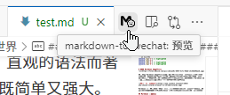
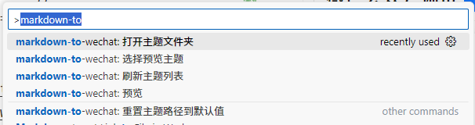

<h1 align="center">VSCode Markdown-to-Wechat</h1>

有没有人像我一样用 VSCode 编辑 Markdown 文本，然后发布到微信公众号的？

通常你需要把 Markdown 内容先复制到其他编辑器，再复制到公众号上。
现在，这一步你可以省略了。

本扩展将 Markdown 转换为微信公众号兼容的 HTML ，直接在 VSCode 上预览复制，与 VSCode 完美结合。

本项目完全开源，无需注册，安装即用。

## 功能特点
1. 在 VSCode 上实时预览 Markdown 内容
2. 一键复制公众号格式 HTML
3. 离线使用
4. 本地 css 主题样式管理
5. 主题色切换
6. 标题编号、强制换行、图片域名、引用链接等特色功能

## 如何使用
当你安装了这个扩展，在你编辑 `markdown` 文件窗口的右上角，会添加一个 `markdown-to-wechat: 预览` 的图标，点击即可。

## 如何自定义主题
你可以通过 VSCode 命令面板，通常默认快捷键是 `Ctrl-Shift-p` ，来使用 `markdown-to-vscode` 的相关命令。

比如 `markdown-to-vscode: 打开主题文件夹` ，它会打开主题文件默认的存储位置。

在 `themes/` 目录内，已经有一个 `custom.css` 文件，你可以直接编辑它，或者新建一个 css 文件。

## 为何开发这个扩展
我日常使用 VSCode 编辑 Markdown ，记笔记、写作，发布到个人博客。
自 2025 年开始写微信公众号，每次发布都要在其他 Markdown 编辑器中转一个流程，这让我觉得挺别扭。
有时候在手机上预览，发现有地方需要修改，这个复制再复制的流程又得重复一次。
为了节省这几分钟，跳过中间环节，所以有了这个扩展。

开发这个扩展的过程中，我还发现了一些额外的好处，比如：
可通过 VSCode 同步配置；
本地管理个人的 css 样式文件，等等。
这样，我就拥有了一个完全自主可控的微信公众号排版工具。
